# Introduction

In this lab you will be created a very simple message flow in ACE Toolkit that uses one of the Discovery (a.k.a "Smart") Connectors to connect to an application with absolutely no code.  (Without even needing to call a REST API nor build or par a JSON message for example).

Note: The flow will be very simple just to illustrate how the connection is made but much more complex integrations can be built on ACE Toolkit.

${toc}

## Create a Message Flow that uses a Discovery Connector Node

1. Launch your IBM App Connect Enterprise toolkit.

   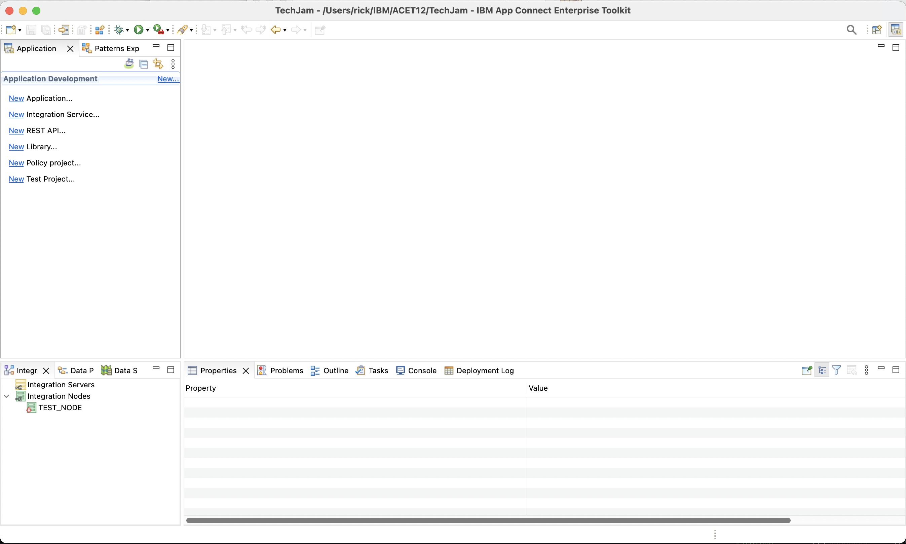

1. Create a new integration server by clicking on integration servers and then click on create a local integration server.

   Note: If you already have an integration server created create a new one.

   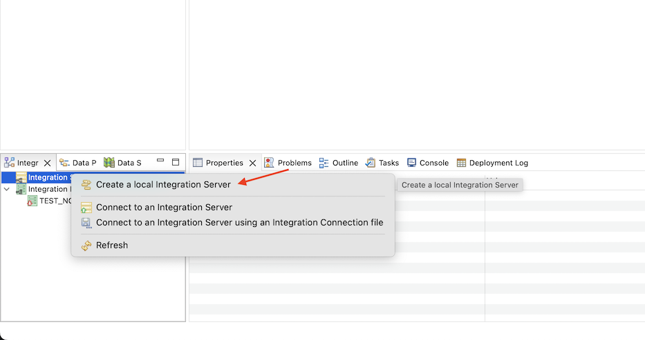

1. In the Create and start a local Integration Server select the option to access an external directory vault. Type any 8 character or longer password as vault key and then press the create vault button.

   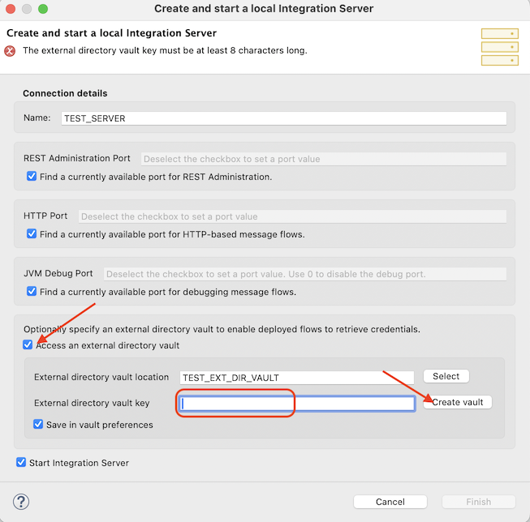

1. Click on the Test access button to validate that the vault was correctly created and then click Finish.

   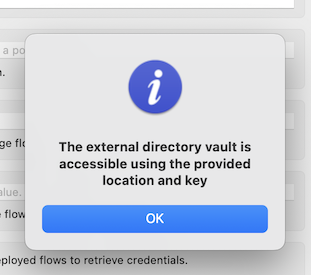

1. Once validated click Finish.

   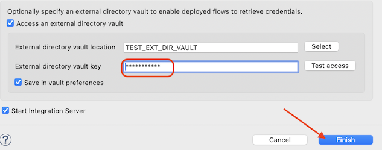

1. In the ACE Toolkit Menu select File --> New --> Application

   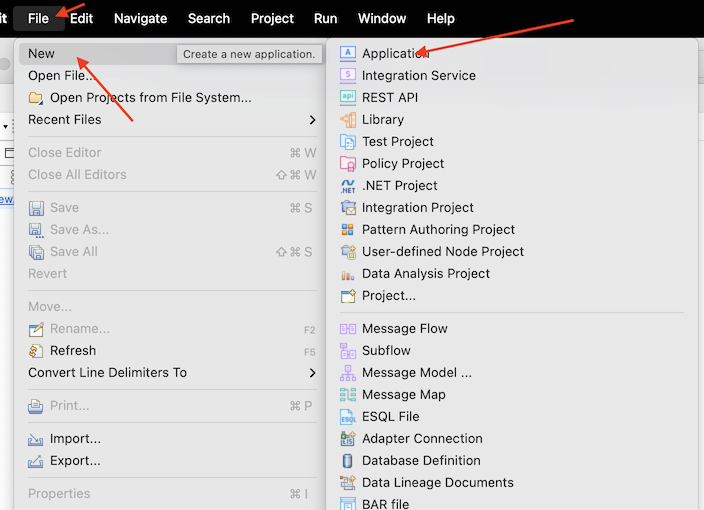

1. Type ServiceNowIncidents as application name and then click Finish.

   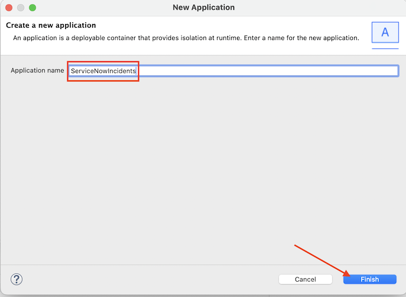

1. On the top left panel click New under the ServiceNowIncidents application and then click on Message Flow.

   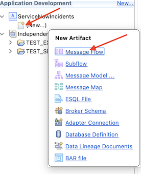

1. Type CreateIncident and message flow name and then click Finish.

   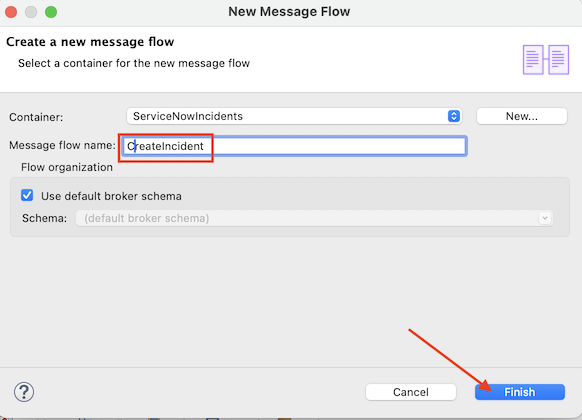

1. The flow editor will open. In the Connectors list search for HTTP, expand the section and then drag and drop one HTTPInput and one HTTPReply connector into the canvas.

   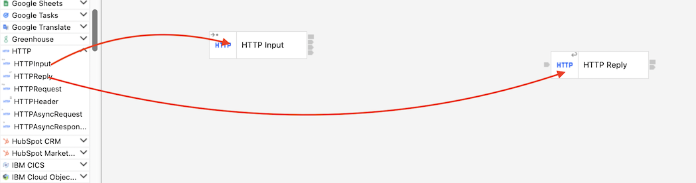

1. Click on the HTTPInput connector you has just dropped into the canvas. In the properties panel located on the button right make sure that the Basic tab is selected and type /createIncident as the Path prefix for URL.

   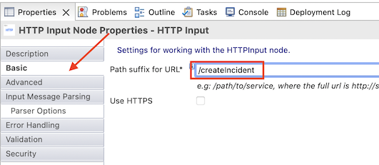

1. Go back to the connector list and search for the ServiceNow Request connector. Drag an drop it into the canvas positioning it between the HTTPInput and HTTPReply connectors you had previously added.

   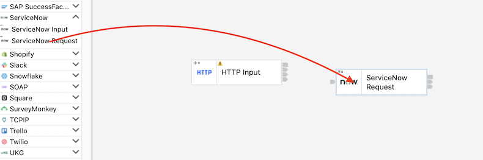

1. Click on the ServiceNow Request connector you have just added and in the properties panel click on the Launch Connector Discovery button.

   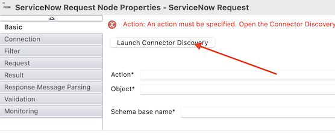

1. Click on the New button to create a policy that will hold the connector configuration.

   

1. Enter ServiceNowPolicies as policy name and click Finish.

   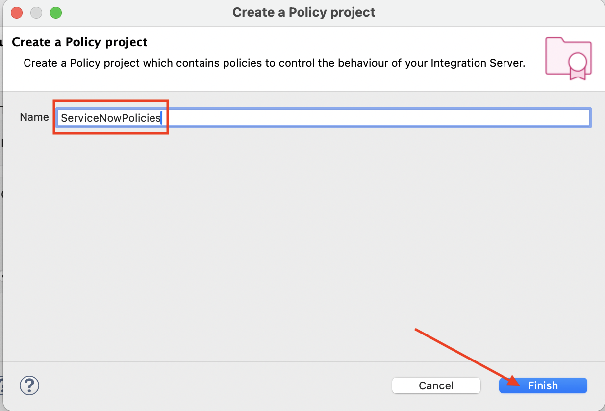

1. Back in the Launch Connector Discovery window type in the vault key you entered while creating the Integration Server

Click on the Test Vault Access button to validate that the key was entered correctly.

   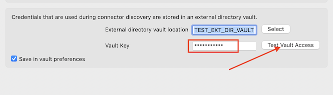

   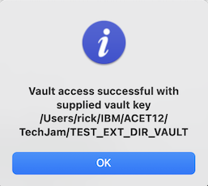

1. Once you get confirmation that the vault access is correct click on the Launch Discovery button. This will launch a new window. It might take a few seconds to pop up.

   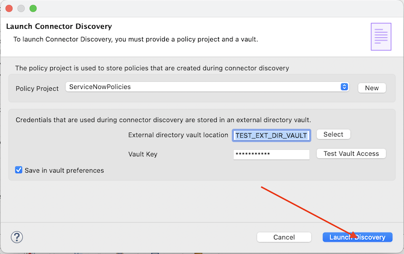

1. The Connector Discovery Window should list just the ServiceNow connector. Click on the expand section icon to list available options.

   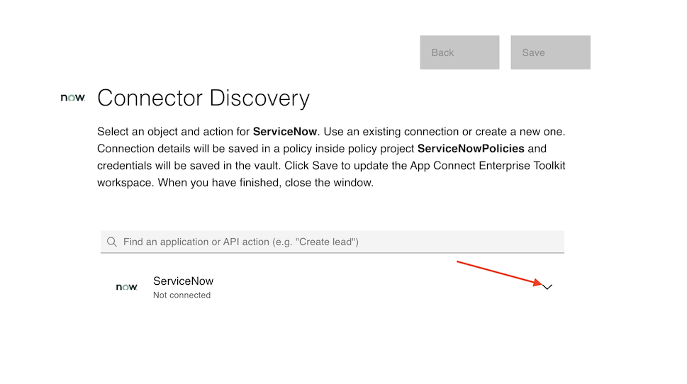

1. You will the a list of business objects and their related actions.  Find the Incident object and click on Create Incident.

   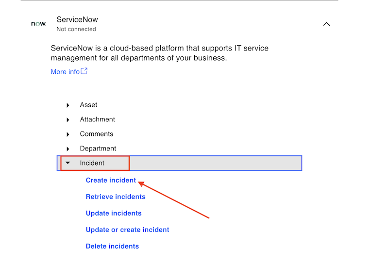

1. Once the Create incident action is selected click on the Connect button.

   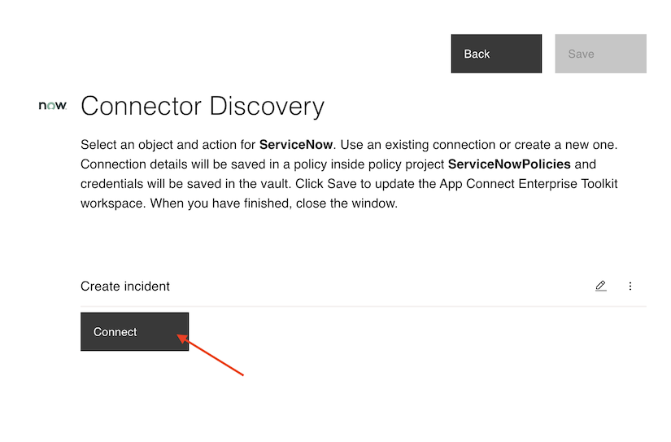

1. Select the OAUTH 2.0 PASSWORD option in the Authorization type field and then enter the credentials. Note: The credentials will be provided to you by the instructor in a file.

   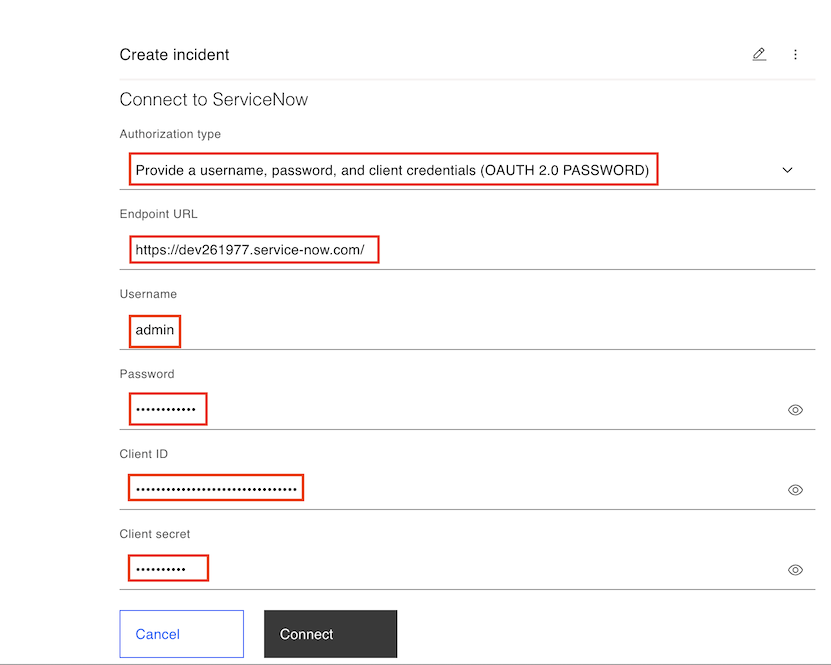

1. In the controls option make sure that Use input Message unchanged is selected and then Click Save.
    You can now the Connector Discovery window.

   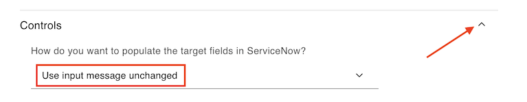

   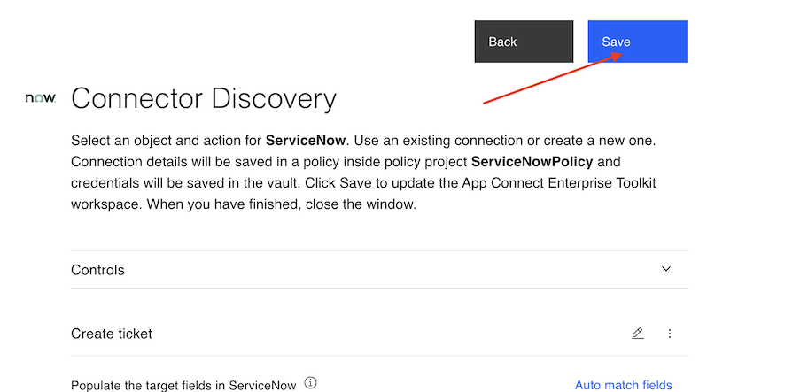

1. Back in ACE Toolkit you will be able to see that JSON schemas for the request and response call to create an incident in ServiceNow where created.

   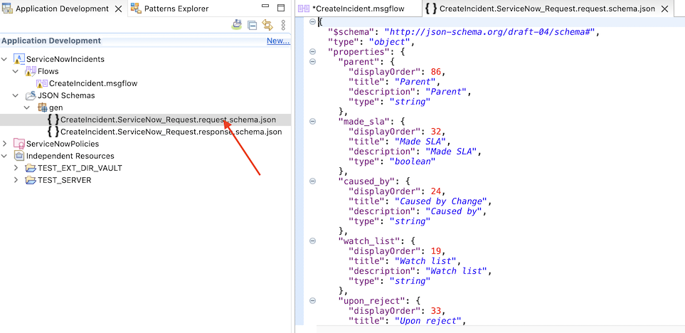

   We'll create a simple hard-coded mapping to test the call to ServiceNow using the connector.

1. Find the Mapping Node located in the Transformation section of the Toolbox.
    Drag and drop the Mapping node between the HTTPInput connector and the ServiceNow Request connector.

   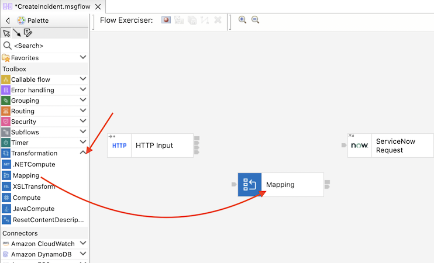

1. Double click on the Mapping Node.

Enter CreateIncident_Mapping as name and click Finish.

   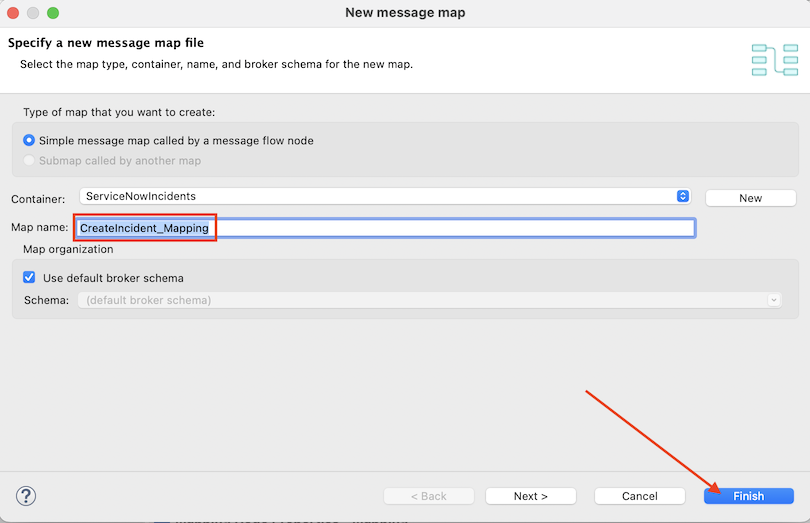

1. The Mapping editor will load with no data. Click on the second (blue) arrow icon to add an output message schema.

   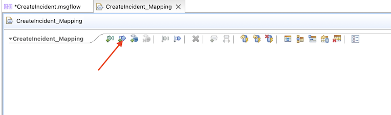

1. Double click on the ServiceNowIncidents application to expand it. Then select the CreateIncident-ServiceNow_Request.request JSON Schema and click OK. The schema wil be added to the mapper.

   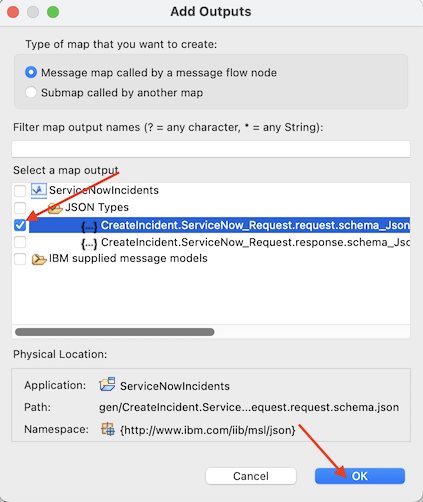

1. Click on the short_description field and hover the cursor over the yellow loop to the left. Right click on it and select the Add Assign option.

   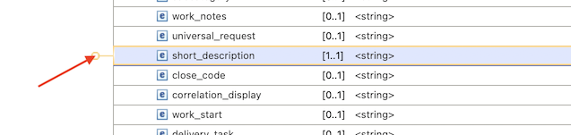

   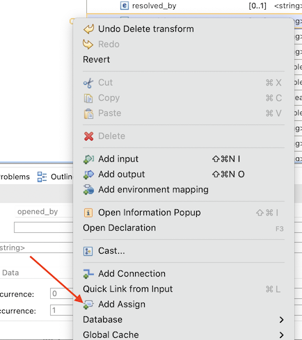

1. While the Assign action is selected type Incident created by and then your name in the properties panel. (Note the screenshot shows "Incident created by ACE" but you need to enter you name. For example "Incident created by John Joe").

   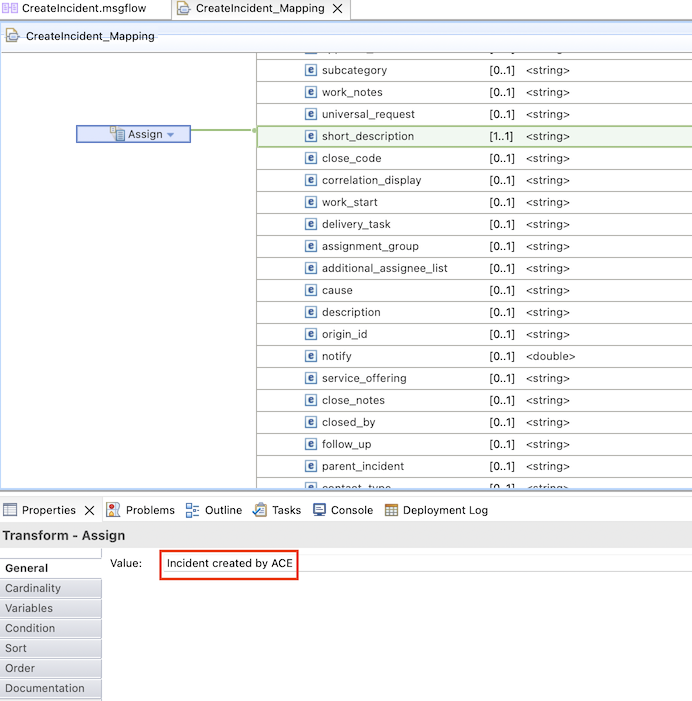

1. Repeat the same assign process to the opened_by field.

   

1. Click in the CreateIncident.msgflow tab to go back to the flow editor. In the flow diagram connect all output terminals to the input terminal of the following node.

   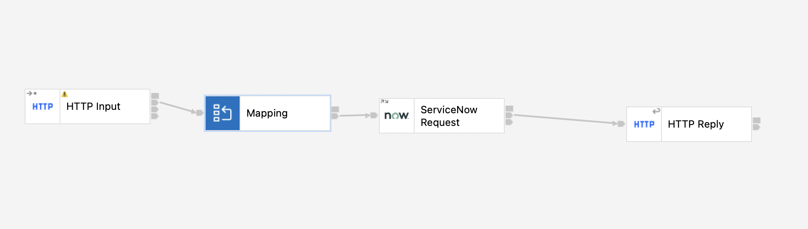

1. Save your work by pressing Ctrl+S (Windows/Linux) or Command+S (Mac).
1. Drag and drop the Policies project to the Integration Server and then do the same with the ServiceNowIncidents application.

   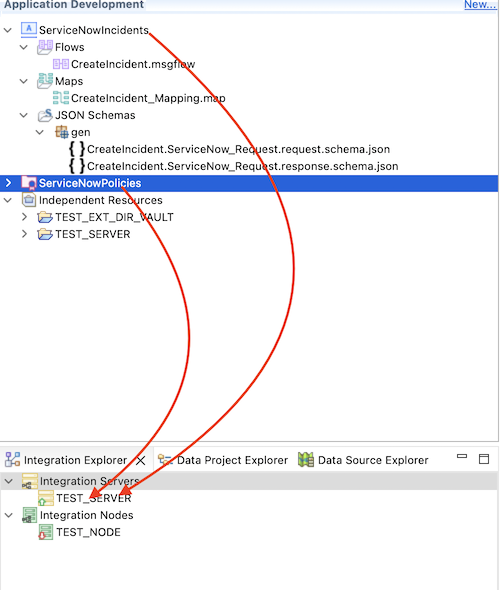

1. Verify that hte application gests deployed and it is running status (up green arrow).

   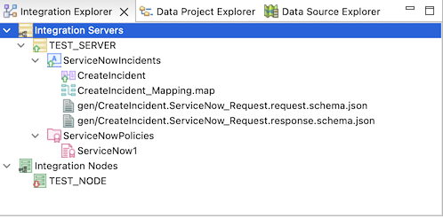

## Test the Message Flow

1. Open a browser window an enter the URL: http://localhost:7800/createIncident

   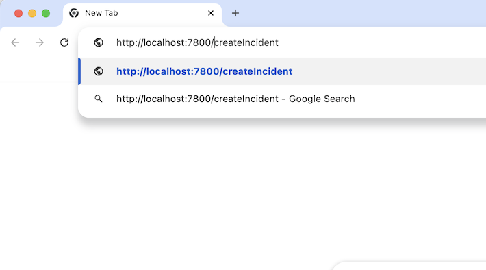

You should get the id of the created incident as response (default response).

   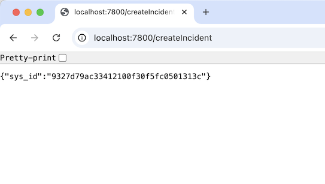

The instructor will show the created incidents table on ServiceNow in the screen. Verify that the incident created by you is there.

   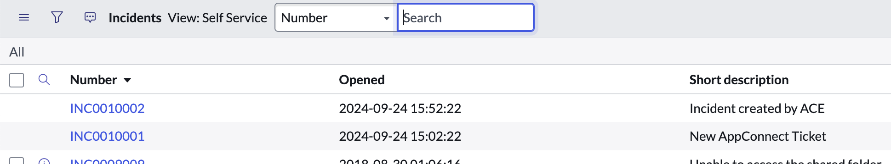
