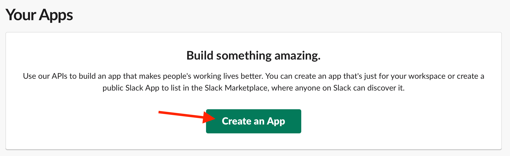
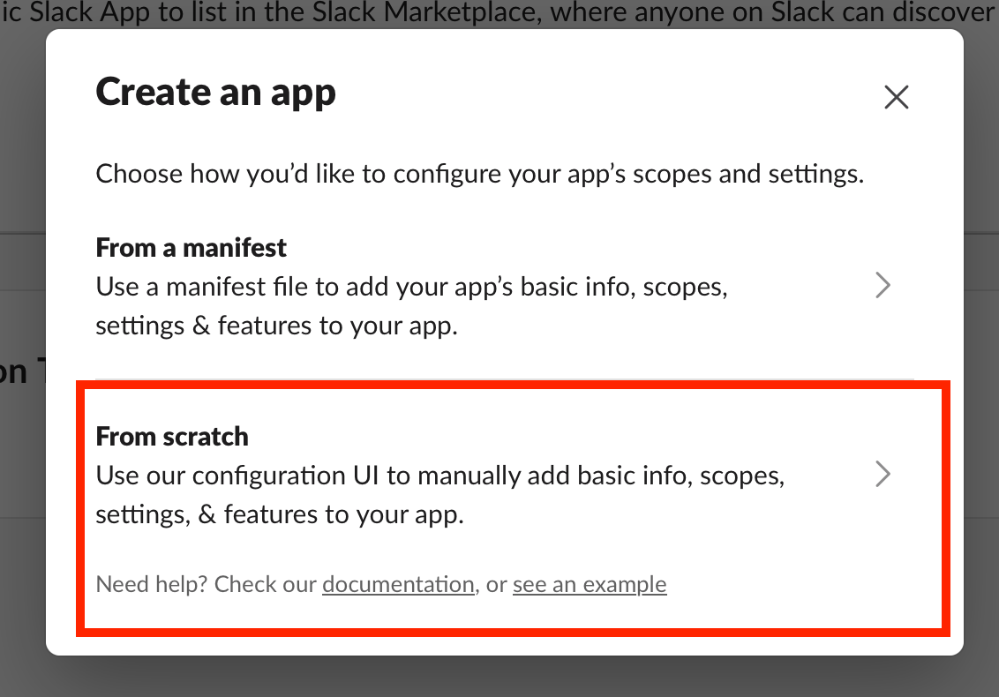
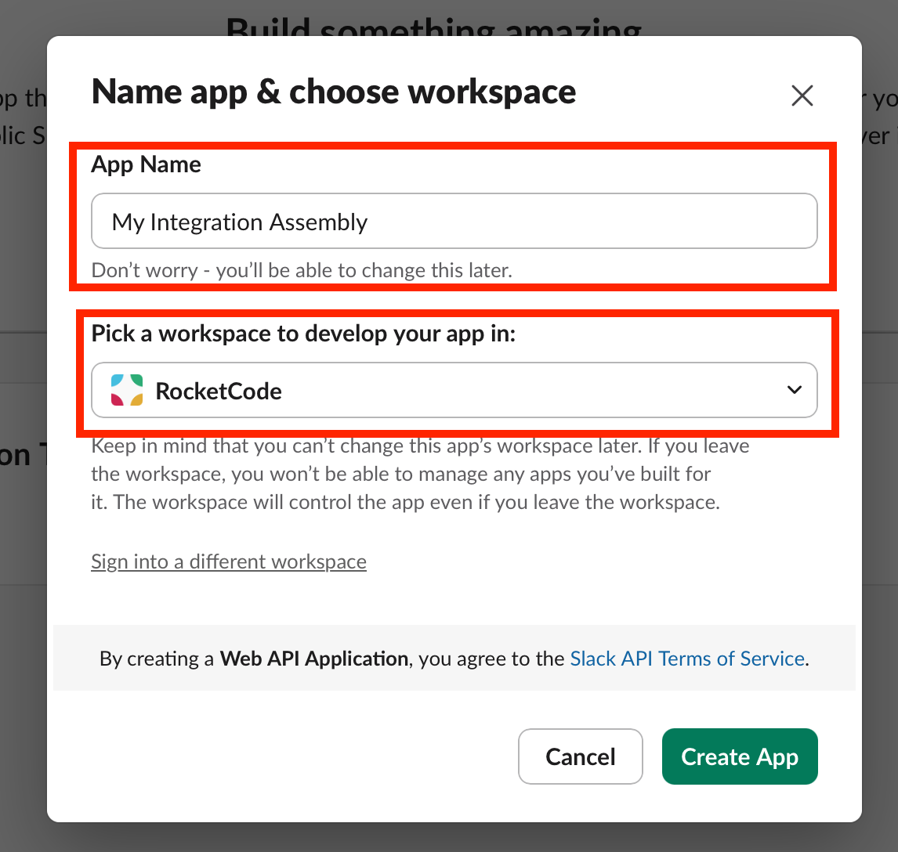
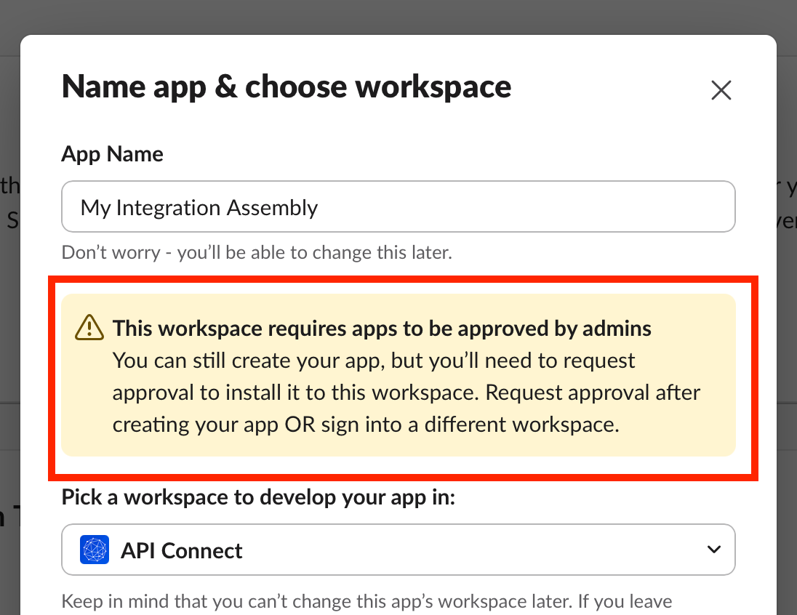
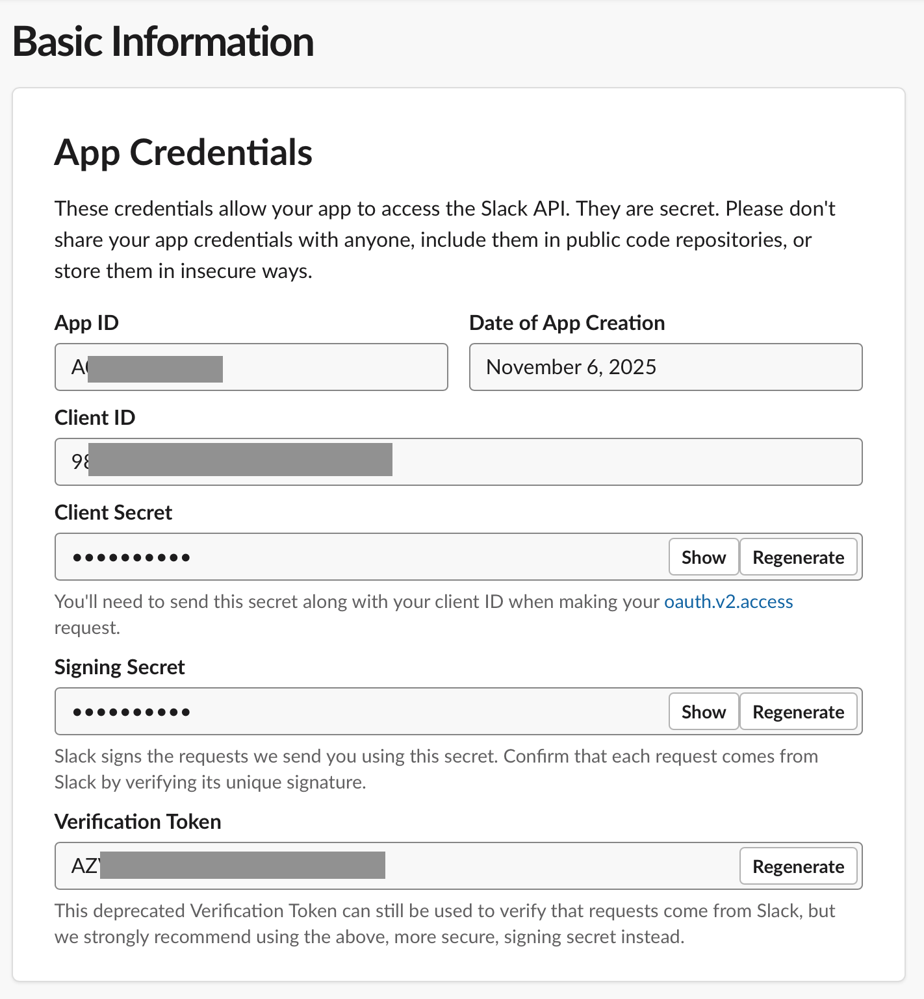

# Simplifying Deployment Using CP4I Integration Assembly

An integration assembly is an instance type that you can use to deploy multiple instances of other IBM Cloud Pak® for Integration capabilities and components from the same YAML file. This feature simplifies ease of instance creation and management, in part by supplying default configurations for complex elements, such as certificates and high availability.

This lab will introduce how to setup and use an Integration Assembly to deploy an Integration Runtime with an existing API flow designed on APP Connect Designer and Declarative API Product to expose corresponding API In API Connect.

## Preparing Third-Party services

To complete this lab, we need API keys for Slack and for Salesforce

### Slack

1. Log in to [api.slack.com](https://api.slack.com/apps) with your normal credentials, or create a test account.
1. After logging in, go back to the same page and click on `Create an App`.

   

1. Select `From Scratch`.

   

1. Give your app a name and choose a workspace to develop your app in.

   

   Many workspaces disallow unapproved third-party apps.

   

   If you do not have a workspace available that permits third-party apps development, you may need to create your own workspace.

   Click `Sign into a different workspace`, Log in with a personal email address and `Create another workpsace`. Click `Create a Workspace` on the next screen, then give your workspace a name. Skip the `invite` step, and `Start with the Limited Free Version`

      

1. Click `Create App`. Note all the app details on the next screen. Note the Basic Information provided.

   

### Salesforce

## Lab Pre-Requisites

- AppConnect Designer Flow already developed and corresponding bar file generated & uploaded to a public git repo [[download](https://github.com/sinamitk/integration-assembly/raw/refs/heads/main/LeadsAPI/BARFiles/SF_Lead_Flow.bar)].
- APIC deployed with shared API Cloud Manager and Gateway, with students having their individual provider organization and able to login to Api manager console.
- Update setting in API Cloud Manager to increase Api Key timeout and enable Multiple use of apikey.
- A shared CP4I platform UI instance.
- Secrets and Configuration for barauth. NOTE barauth is not third party /NOTE , salesforce & slack connection and apic connection are pre-created in all individual student namespaces.

## App Connect Flow Details

Below described flow was developed using App Connect Designer and a bar file has been generated & uploaded to github to be used to deploy using Integration Assembly. (Note: This section is just for information describing app connect flow being used as part of lab).

It is having two defined operations of Create Lead (POST) and Retrieve Lead by ID (GET).

[ image ]

The 'Create Lead' flow takes the fields in API model, maps them to the Salesforce connector 'Create Lead', updates Salesforce and also sends a slack message that a new lead has been created. It then returns the data back to the API flow

[ image ]

The 'retrieve' flow gets the lead from Salesforce corresponding to the lead ID and sends the details back to the requester.

[ image ]

## Create an Assembly in CP4I

1. Open the Platform Navigator(Link provided in reference sheet). Enter the username and password provided to log on.

[ image ]

2. Login to Platform UI and Click on Create an Instance.

[ image ]

3. Click on Assembly.

[ image ]

4. Select Blank canvas and the click Next.

[ image ]

5. Click on Assembly managed and drag-drop the Integration runtime to empty canvas.

[ image ]

6. Hover over mouse over Integration Runtime in Canvas and click on pencil icon to edit.

[ image ]

7. Update the Integration runtime properties.

   [ image ]

   [ image ]
   
   [ image ]

   - **Name**: student<Id>-ir
   - **Namespace**: tech-jam-ace-tech-jam-<studentId>
   - **License**: Click Accept and select License from drop down. Select CloudPakForIntegrationNonProduction for License use.
   - **BAR URLs**: click on Add + and provide Bar file github link(https://github.com/sinamitk/integration-assembly/raw/refs/heads/main/LeadsAPI/BARFiles/SF_Lead_Flow.bar)
   - **Configurations**: Click on Add+ and add configurations `barauth-empty-conf` and `cred-designer-acc-conf` (these are pre-created for you).
      - **barauth-empty-conf** - It contains configuration with secret for authorizing pull of bar from github.
      - **cred-designer-acc-conf** - It contains configuration with secret containing credentials for salesforce and slack accounts being used in Ace flow.

   Click on Update after adding above properties. You will see Assembly like below image.

   [ image ]

8. Click on Independent instances and drag-drop the API Product to Canvas. Click on pencil icon to edit.

   [ image ]

9. Update the API Product properties.

   [ image ]

   - **Name**: student<Id>-api
   - **Namespace**: tech-jam-ace-tech-jam-<studentId>
   - **Credentials secret**: Select apim-credentials from drop down (apim-credentials secret is pre-created, which contains credentials to connect APIC) NOTE create secret /NOTE
   - **Provider Organization**: tech-jam-<studentId>
   - **Catalog**: sandbox

   Scroll down
   
   [ image ]
   
   - **State**: Select Published from drop down
   - **Definition->Info->Title**: student\<Id>-iaprod
   - **Definition->Info->Name**: student<Id>-iaprod
   
   Further scroll more and set Integration runtimes:

   [ image ]
   
   - Click on Add +
   - Select student<Id>-ir integration runtime created earlier above.
   - Click Update.

10. Update Integration Assembly metadata. Click on UI form tab.

   Update the below
   
   [ image ]

   - **Name**: ia-student<Id>
   - **Namespace**: tech-jam-ace-tech-jam-<studentId>
   - **License**: Make sure License is accepted & License Id is populated.

   Then click on Create.

   [ image ]

11. You will see Integration Assembly Instance being created in Platform UI console.

   It will be in Pending state initially.

   [ image ]

   Wait for couple of minutes then click on Refresh button.

   [ image ]

   You will see Assembly in Ready state with Integration runtime, API Product and API deployed.

   [ image ]

## Validation and Testing

1. Go to the API Manager console using the link provided in reference sheet. Click on Cloud Pak User Registry.

   [ image ]

2. Login to API Manager instance with your credentials.

   [ image ]

3. Click on Catalogs.

   [ image ]

4. Click on Sandbox catalog.

   [ image ]

5. You will see the student<Id>-iaprod product published to it. Click on Catalog Settings

   [ image ]

6. Go to Portal and copy Portal Url & open in a separate tab.

   [ image ]

7. You might see a page like below, click on Advanced and then proceed to Link. ( Below page might differ as per browser)

   [ image ]

8. Published product will be seen on Portal.

   Click on Sign in to login into consumer portal.

   [ image ]

9. Provide apic dev portal username and password provided in reference sheet and click Sign in.

   [ image ]

10. After logged in, click on API Products to see available products.

   [ image ]

11. Click on the product published using Integration Assembly (student<Id>-iaprod).

   [ image ]

12. You will see corresponding API. Click on it.

   [ image ]

13. You will see the endpoints available in APIs. Click on Get access to create application and subscribe to API for testing it.

   [ image ]

14. Select the Default Plan available.

   [ image ]

15. Create an Application to subscribe API.

   - Click on + Create Application.

      [ image ]

   - Provide Title and Description. Click Save.

      [ image ]

   - Copy Key and Secret which will be used to test API later(Secret won’t be displayed again so copy and keep it safely). Click on close sign(x).

      [ image ]

16. Click on the App created in step above.

   [ image ]

17. Confirm subscription by clicking on Next.

   [ image ]

18. Click on Done.

   [ image ]

19. Click on `Post /lead` operation to test it. This will create a Lead based on request body provided in Salesforce and sent a slack message. It returns the Id of the lead created in Salesforce.

   [ image ]

20. Click on Try it.

   [ image ]

21. Select Consumer App created earlier for API Key.

   Click on Generate to get a sample request (You can check Firstname/Email in request to validate later response of Get call)

   Then click Send.

   [ image ]

22. In case you see below response, click on the link from the response.

   [ image ]

23. Click on Advanced.

   [ image ]

24. Click on Proceed to link provided.

   [ image ]

25. Close the tab and go back to apic developer portal tab.

   [ image ]

26. Click on Send again.

   [ image ]

27. You will see a success response with created Id returned. It will create a Lead in Salesforce and send a slack message. Copy the Id received in response.

   [ image ]

28. Click on Get /lead/{id} operation. This operation will get the Lead details from Salesforce based on Id provided in request.

   [ image ]

29. Click on Try it.

   [ image ]

30. Select Consumer App created earlier for API Key.

   Paste the Id generated in POST Call above

   Then Click Send.

31. A successful 200 Response will be seen with response body showing the Lead submitted in Post call (You can cross verify by comparing the response details say FirstName/Email with request body sent as part of Post call)

## Summary

Congratulations on creating and testing the integration assembly. This is one of the many examples of how integration assembly can simplify deployment of cp4i components and their instances.
