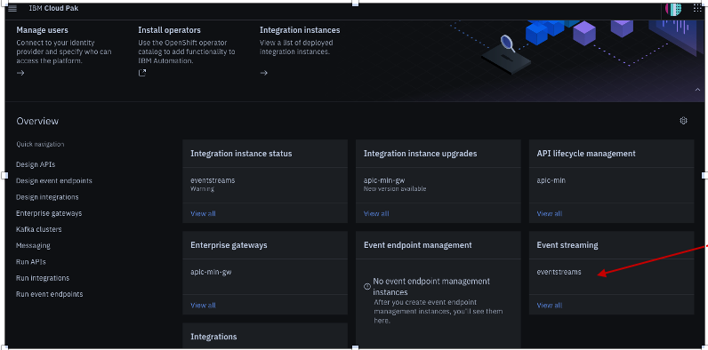

### [Return to main EventStreams lab page](../event-streams)

---

# Table of Contents
1. [Objectives](#objectives)
2. [Prerequisites](#prerequisites)
3. [Getting started with Lab3](#deploy)
    1. [What is a Schema Registry ](#sch-registry)
    2. [How the Schema Registry Works](#sch-registry-work)
    3. [Creating a topic and attaching a schema to it](#topic)
    4. [Creating a Kafka User with appropriate rights](#create-user)
    5. [Gather Connection Details](#collection)
    6. [Test Producer and Consumer](#test)
    7. [Check the Impact of Changing the Schema Registry](#test-registry)

---

## 1. Objectives <a name="objectives"></a>

In this lab you will learned how to:

-	Create a topic and attach a schema to it
-	Create a Kafka user with appropriate rights to produce and consume data
-	Gather information needed to connect to the Kafka / Schema clusters.
-	Test producing / consuming data.
-	Make changes to the Schema and see the impact to producer/consumer.

## 2. Prerequisites <a name="prerequisites"></a>

-	Have setup the client machine properly. 
-	Able to access the Event Streams web interface.	
-	Reserve the lab environment. If you have not reserved the lab environment yet, then click [here](https://techzone.ibm.com/collection/jam-in-a-box-for-integration-automation-cp4i/environments)
-	Go through the presentation to get the knowledge about EventStreams capabilities. Click [here](https://ibm.box.com/s/326ddepzvqxu96fuw3m151vadjpyqcym)


## 3. Getting started with Lab3 <a name="deploy"></a>
## 3a. What is a Schema Registry? <a name="sch-registry"></a>

Schema Registry provides a serving layer for your metadata. It provides a RESTful interface for storing and retrieving your Avro®, JSON Schema, and Protobuf schemas.	
•	It stores a versioned history of all schemas based on a specified subject name strategy, provides multiple compatibility settings.	
•	Allows evolution of schemas according to the configured compatibility settings and expanded support for these schema types. 	
•	Provides serializers that plug into Apache Kafka® clients that handle schema storage and retrieval for Kafka messages that are sent in any of the supported formats.	

In Event Streams, Schemas are stored in internal Kafka topics by the Apicurio Registry, an open-source schema registry. In addition to storing a versioned history of schemas, Apicurio Registry provides an interface for retrieving them. Each Event Streams cluster has its own instance of Apicurio Registry providing schema registry functionality.


## 3b. How the Schema Registry Works? <a name="sch-registry-work"></a>

Now, let’s take a look at how the Schema Registry works.

1.	Sending applications request schema from the Schema Registry.	
2.	The scheme is used to automatically validates and serializes be for the data is sent.	
3.	Data is sent, serializing makes transmission more efficient.	 
4.	The receiving application receives the serialized data.	
5.	Receiving application request the schema from the Schema Registry.	 
6.	Receiving application deserializes the same data automatically as it receives the message.	


## 3c. Creating a topic and attaching a schema to it <a name="topic"></a>

1\. Open this PlatformNavigator URL from a browser.
  

   - Use admin/password that has been shared with you by TZ.
   - Clieck on the Evvent Streaming instance as showed in the below screenshot.
   
   -   That should bring you to the Event Streams Console home page. 
   <br/>

   
   <br/>
2\. Create Topic** <br/>
      
    <br/>

   - Refer to screenshots below as an example.  <br/>  
      
      <br/>  
      <br/>  
      <br/>  
      <br/>  

3\. Next create the schema and attach to the topic. <br/>
   Click on the Schema Registry tab in the left. <br/>

    <br/>
   
   Click on Add Schema (in the right) <br/>
   
    <br/>
   
   Click Upload Definition -> Choose customer.avsc located in the Kafka Client unzipped folder. <br/>
   **`C:\TechJam\EventStreams_Lab\KafkaClient_YYYYMMDD\com\example`** <br/>

    <br/>

   Check the details and make sure the schema is valid.  

   Change the name of the schema. The name of the schema maps the schema to the topic. To attach this schema to your topic, the schema should be named according to the topic: **<topic_name>-value.**

   For example, if your topic is **“jam60-topic1”**, the schema should be named **“jam60-topic1-value”** <br/>

    <br/>

   Click on Add Schema. The schema is now attached to the topic. <br/>

## 3d. Creating a Kafka User with appropriate rights <a name="create-user"></a>

1\.	Go to the Event Streams home page.
   Select "Connect to this Cluster" -> Generate SCRAM Credentials. <br/>

    <br/>

    <br/>

   Refer to the screenshot attached as reference. <br/>

      <br/>  
      <br/>  
      <br/>  
      <br/>  
      <br/> 

## 3e. Gather Connection Details <a name="collection"></a>

Creating connection from Consumer / Producer requires some connectivity details. These details can be gathered from the Event Stream’s portal. Connectivity details needed will depend on type of authentication and SASL mechanism used. 

From the Event Stream home page, click on “Connect to this Cluster”.  Get the following information from the page. Refer to screenshot below on how to get these.  
   -  Bootstrap URL  
   -  Truststore Certificate File. Copy the downloaded file to the Kafka Client folder.  
   -  Truststore Password. (Password will be generated once Download Certificate is clicked).  
   -  Schema Registry URL  

   <br/> 
   <br/> 

## 3f. Test Producer and Consumer <a name="test"></a>

1\.	Prepare the config.properties file located in C:\TechJam\EventStreams_Lab\KafkaClient_YYYYMMDD\
Check and change the following fields. The fields not mentioned here can be left default.

|  Field                            | Value                 |  
|-------------------------|-----------------------------------------|
|enableschemaavro	        |  True (as we have schema attached to the topic) |
|bootstrap.servers	     |  Enter the URL obtained in previous section **e.g. es1-kafka-bootstrap-cp4i.apps.ocp46.tec.uk.ibm.com:443**|
|sasl.jaas.config	        |  Paste this string. Replace the Username and Password.  `org.apache.kafka.common.security.scram.ScramLoginModule required username='<SCRAM_USER>' password='<SCRAM_PASSWORD>'`;
|sasl.mechanism           |  SCRAM-SHA-512  |
|security.protocol	|  SASL_SSL|
|topic	|  Topic created previously. **E.g. jam60-topic1**|
|group.id	| Enter a Consumer Group ID. You can enter a Consumer Group. Remember that it should have a prefix of your studentID. **E.g. jam60-consumer-group-v1**|
|ssl.truststore.location	|  Should point to the Truststore certificate downloaded. **Example:  ./es-cert.p12**|
|ssl.truststore.password	|  Enter the Truststore password obtained. |
|schema.registry.url	   |  Enter the URL obtained in previous section **e.g. https://es1-ibm-es-ac-reg-external-cp4i.apps.ocp46.tec.uk.ibm.com**|
|schema.registry.basic.auth.user.info	|  <SCRAM_USER>:<SCRAM_PASSEORD>|
|schema.registry.ssl.truststore.location	|  Same as ssl.truststore.location|
|schema.registry.ssl.truststore.password	|  Same as ssl.truststore.password|
	
This is how your config.properties should look like after he changes. This is a sample. Do not copy and paste this contents. 

```
## Mandatory Section ##
# Set to true if avro schema is enabled for the topic
enableschemaavro = false
# Set to true if want to enable Intercept Monitoring.
enableintercept = false
# Set this to true if mTLS (2-way TLS authentication) is enabled.
enablemtls = false
# Broker related properties
bootstrap.servers = eventstreams-kafka-bootstrap-cp4i.apps.daffy-2coilkk8.cloud.techzone.ibm.com:443
sasl.jaas.config = org.apache.kafka.common.security.scram.ScramLoginModule required username='deb-kafka01' password='p42k6RzhOsyMwqrroJx5jHwyBeiw1U1C';
# Example: sasl.jaas.config = org.apache.kafka.common.security.scram.ScramLoginModule required username='student01' password='B9BmjHvJZC';
# Options are PLAIN, SCRAM-SHA-512, GSSAPI
sasl.mechanism=SCRAM-SHA-512
# Options are SSL, PLAINTEXT, SASL_SSL, SASL_PLAINTEXT
security.protocol=SASL_SSL
topic=deb-topic2
# Consumer Group ID
group.id = deb-consumer-group-v1
# Example: group.id = student01-group
client.id=302071b2-7daf-4844
#--------------------------------
## To be filled in if TLS is enabled for the Brokers
# Options are PKCS12, JKS, PEM. Password not required for PEM.
ssl.truststore.type=PKCS12
ssl.truststore.location=/Users/debasreemallick/Downloads/KafkaClient_20221204/es-cert.p12
ssl.truststore.password=KWEsvBr3tdXJ
#--------------------------------
## To be filled if mTLS (Mutual TLS) is enabled in Brokers
ssl.keystore.location=/home/rajan/load_security/kafka.client.keystore.jks
ssl.keystore.password=clientpass
ssl.key.password=clientpass
#-------------------------------
## To be filled in if Schema is enabled
apicurio.registry.url = https://eventstreams-ibm-es-ac-reg-external-cp4i.apps.daffy-2coilkk8.cloud.techzone.ibm.com
# To be set to true if schema is not created up front.
auto.register.schemas=false
## To be filled in if Schema Registry requires Authentication.
basic.auth.credentials.source = USER_INFO
schema.registry.basic.auth.user = deb-kafka01
schema.registry.basic.auth.password = p42k6RzhOsyMwqrroJx5jHwyBeiw1U1C
#--------------------------------
## To be filled in if TLS is enabled for Schema Registry
schema.registry.ssl.truststore.type=PKCS12
schema.registry.ssl.truststore.location=<LOCATION OF PKCS12 CERT DOWNLOADED>
schema.registry.ssl.truststore.password=<TRUSTSTORE_PASSWORD>
#--------------------------------
## To be filled if Consumer / Producer Intercept should be turned on
intercept_bootstrapServers = es3minimal-kafka-bootstrap-es3.mycluster-rajan07-992844b4e64c83c3dbd5e7b5e2da5328-0000.jp-tok.containers.appdomain.cloud:443
intercept_sasljaas = org.apache.kafka.common.security.scram.ScramLoginModule required username='rajan' password='CfKQZG9Cm7g5';
intercept_security = SASL_SSL
intercept_saslmechanism = SCRAM-SHA-512
#--------------------------------
## To be used when Kerberos Authentication is used
sasl.kerberos.service.name=kafka
#--------------------------------
## Other Optional parameters.
retries = 2
```

2\. Test Producing Message

Goto this folder in command prompt:
```
cd C:\TechJam\EventStreams_Lab\KafkaClient_YYYYMMDD\ 
java -jar KafkaClient.jar producer 10 config.properties
```

Check if the message is listed in the topic. In the Event Streams portal, go to Topics. Look for the topic that you created. Click on it. Then click on messages.  You should see the messages produced. 
***[\*\* The messages content may not be displayed correctly in the portal due to deserialization error. ]***

   <br/> 

3\. Test Consuming Message

`java -jar KafkaClient.jar consumer config.properties`

Messages should be consumed correctly.  Message content should be displayed correctly. 
Press CTRL-C to stop the consumer.

   <br/>

## 3g. Check the Impact of Changing the Schema Registry <a name="test-registry"></a>

1\.	We will change the schema registry and check what happens when producing / consuming. 
In the client computer, make a copy of the customer.avsc file (located in C:\TechJam\EventStreams_Lab\KafkaClient_YYYYMMDD\com\example>) and name it customer_v2.avsc. You can do this from Windows Explorer.

Edit the file using Notepad++. Add this line right after country. Change the version.
`{ "name": "company", "type": "string", "doc": "Customer Company" },`

The customer_v2.avsc should look like this:
   <br/>

2\. From the Event Streams portal, Go to Schema Registry -> Click on your Schema. Then, click on “Add New Version”.
      <br/>
   
3\. Click on “Upload Definition” and select the edited avsc file (customer_v2.avsc).
   
   You should get a validation failed message.

      <br/>

4\.	Understanding Schema Registry Evolution

   When a schema is created, it has to have a compatibility mode. The most used compatibility modes are:
      -  ***BACKWARD*** - new schema can be used to read data written with old schema [e.g. consumer uses the new schema and read an older offset data]
      -  ***FORWARD*** - old schema can still be used (e.g. by consumers) to read data written in new schema
      -  ***FULL*** - Both forward and backward
   
   In Event Streams, the default compatibility mode is **FULL**. 
   In our customer_v2.avsc we have added a new mandatory field. Older consumers may not be aware of this field until they update their code. Hence, our schema is NOT FORWARD compatible and so, it fails validation.

5\.	Now, edit the schema file (customer_v2.avsc) again and add a default value to the newly added line. The line should look like this:

   `{ "name": "company", "type": "string", "default": "IBM", "doc": "Customer Company" },`

   The customer_v2.avsc should look like this.

      <br/>

6\.	Now try updating the schema. 
   Validation should pass. 
   Change the version number and click on “Add Schema”.

7\. Test producing / consuming data

8\.	Getting details about the schema. 
   The Event Streams schema registry supports a Rest Endpoint that provides details about the schema. 

   First make sure you have the Basic Authentication Token created during the process of creating the Kafka SCRAM User. If you missed copying the token, you can generate the token from the SCRAM USERNAME and SCRAM PASSWORD. 
   Open this URL: 
   https://www.base64encode.org/ 

   Enter your SCRAM USERNAME and SCRAM PASSWORD separated by a colon.
   E.g. <SCRAM_USER>:<SCRAM_PASSEORD>
   Click on Encode and it will generate the Basic Authentication Token. 

   Get the default compatibility.
   ```
   curl -ki -X GET -H “Accept: application/json” -H “Authorization: Basic <BASIC AUTH TOKEN>” https://<SCHEMA_REGISTRY_URL>/rules/COMPATIBILITY
   E.g. 
   curl -ki -X GET -H “Accept: application/json” -H “Authorization: Basic <BASIC_AUTH_TOKEN>” https://es1-ibm-es-ac-reg-external-cp4i.apps.ocp46.tec.uk.ibm.com/rules/COMPATIBILITY

   The response should be something like:
   {"config":"FULL","type":"COMPATIBILITY"}
   ```
   This shows that the default compatibility is FULL. 

   Next get the compatibility of the specific schema that we are using. 
   ```
   curl -ki -X GET -H “Accept: application/json” -H “Authorization: Basic <BASIC_AUTH_TOKEN>” https://es1-ibm-es-ac-reg-external-cp4i.apps.ocp46.tec.uk.ibm.com/artifacts/<YOUR_SCHEMA_NAME>/rules
   ```
   This should give you an empty response []  
   Which basically means – the schema uses the default global setting – which is FULL (as we saw when we tried changing the schema).


### [Return to main EventStreams lab page](../event-streams)
