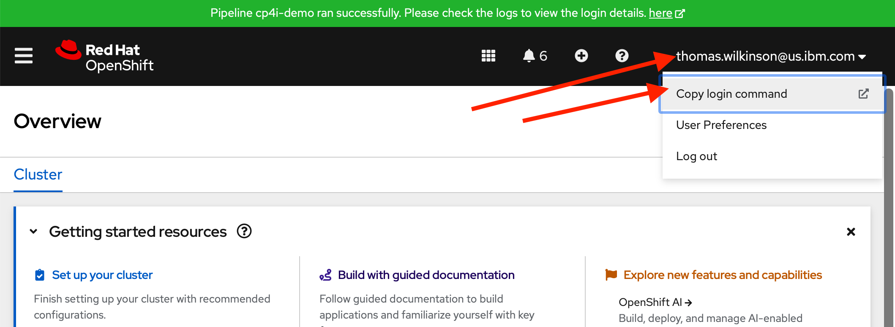
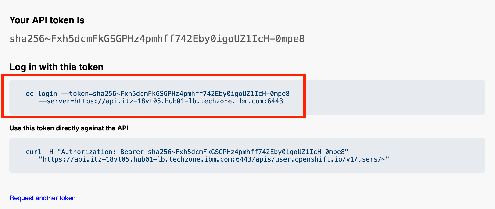

# MQ

## Labs

1. [Deploy a Cloud Native HA persistent IBM MQ Queue Manager on CP4I](Deploy%20QM.html)

## Prerequisites

1. Have the OpenShift `oc` command line installed on your local machine. This can be downloaded from either:
    1. {{ cliDownloadLink | Your local OpenShift console}}, or
    1. [developers.redhat.com](https://developers.redhat.com/learning/learn:openshift:download-and-install-red-hat-openshift-cli/resource/resources:download-and-install-oc)

1. Use `oc` to log in to OpenShift

    1. Get a login command from the OpenShift Console. Click on your username at the top right corner and then select `Copy login command`

    

    1. You may be asked to log in again. Once you have logged in, click `Display Token`.

    1. Copy and paste the entire `oc login` command line into your terminal.

    

